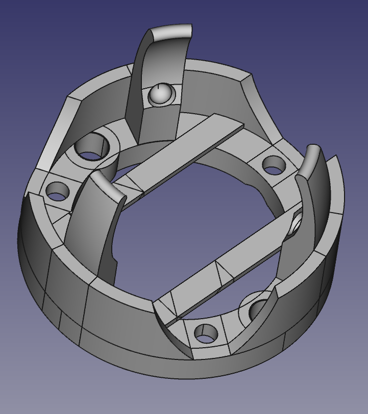
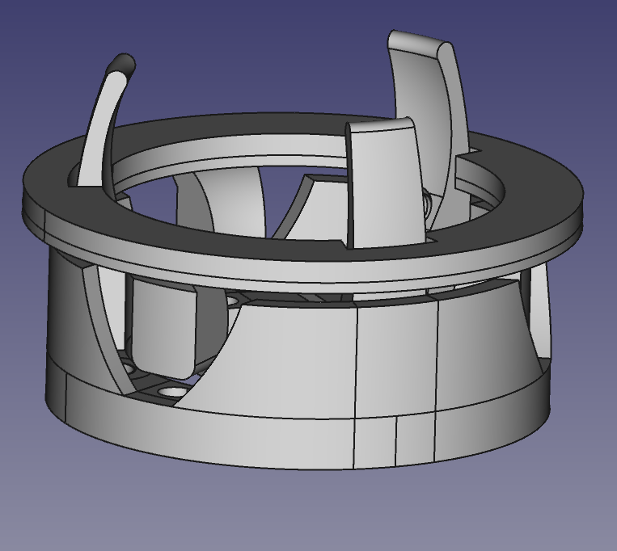
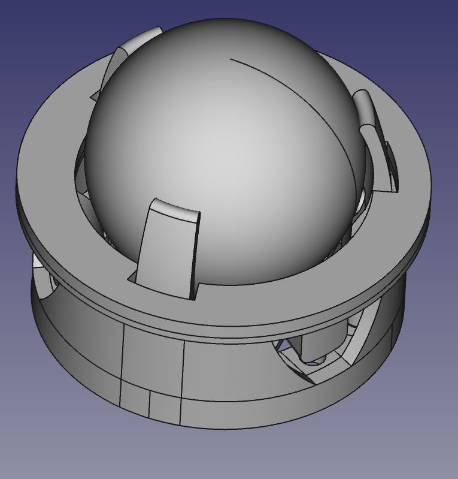

##  Trackball holder
Крепление для трекболла.
##### Посадочное место для трекболла

##### Посадочное место + клипса для крепления в корпусе клавиутуры

##### Все крепление в сборе

#### Предупреждение
На данный момент крепление находить на стадии разработки и пока что готов только корпус. Данный корпус полностью совместим с [Bastardkb](https://github.com/Bastardkb), поэтому для сборки подходят их платы.
## Печать
Все модели полностью подготовленны к печати и не требуют поддержек.

В качестве подшпника используются 3 шарика, диаметром 3мм.
